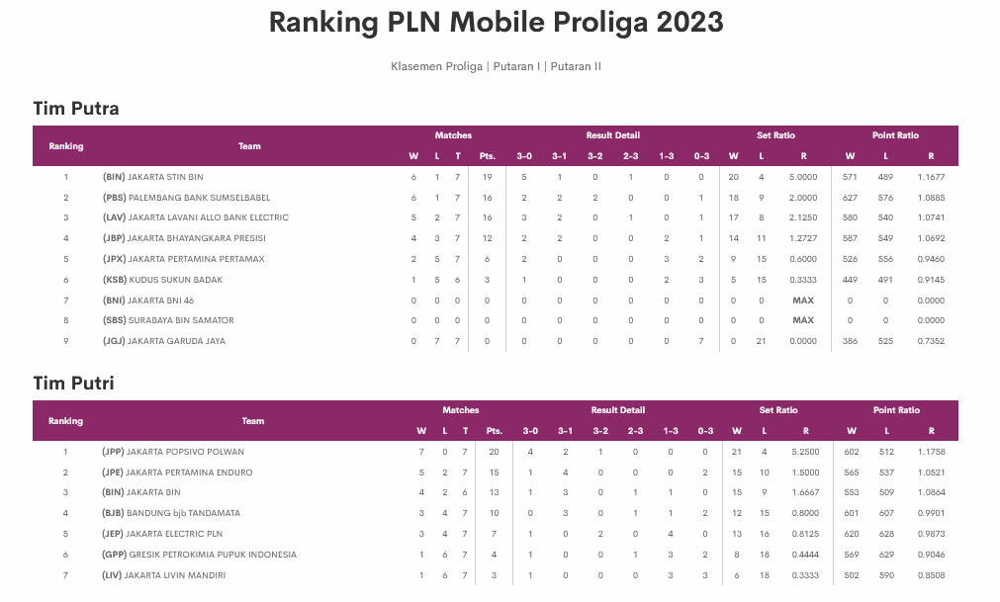
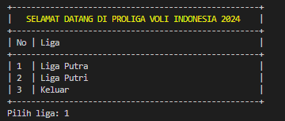

# Algoritma dan Struktur Data

Vira Alfita Yunia

TI-1B

29

2341720055

## Pertemuan 13: Kuis Struktur Data

### Proliga Voli Indonesia

Proliga, atau Proliga Bola Voli Indonesia, adalah turnamen bola voli paling bergengsi di Indonesia yang digelar setiap tahun sejak tahun 2002. Kompetisi ini diikuti oleh tim-tim terbaik dari seluruh negeri, baik tim putra maupun putri, dan menjadi ajang pembuktian kemampuan serta strategi dalam olahraga voli. Proliga tidak hanya memajukan kualitas permainan voli nasional, tetapi juga menjadi wadah pembinaan dan regenerasi atlet-atlet muda berbakat. Dengan atmosfer yang kompetitif dan penuh semangat, Proliga telah menjadi salah satu acara olahraga yang dinantikan oleh para penggemar voli di Indonesia, serta menjadi magnet bagi sponsor dan media. Ajang ini turut memperkenalkan inovasi dan gaya bermain yang dinamis, sekaligus mempererat rasa kebersamaan dan kebanggaan nasional melalui olahraga.

### Klasemen Proliga Voli Indonesia

### Hasil Output Program

#### Tampilan Menu Utama

#### Tampilan Menu Liga Putra

#### Tampilan Menu Tambah Tim Putra

#### Tampilan Menu Catat Pertandingan Putra

#### Tampilan Menu Klasemen Liga Putra

#### Tampilan Menu Liga Putri

#### Tampilan Menu Tambah Tim Putri

#### Tampilan Menu Catat Pertandingan Putri

#### Tampilan Menu Klasemen Liga Putri

