

# Algoritma dan Struktur Data

Vira Alfita Yunia

TI-1B

29

2341720055

## Pertemuan 11 (Linked List)

### Percobaan 1

Kode program

Node29.java

    package Pertemuan12.Percobaan1.src;

    public class Node29 {
        int data;
        Node29 next, prev;

        public Node29(Node29 prev, int data, Node29 next) {
            this.prev = prev;
            this.data = data;
            this.next = next;
        }
    }

Kode program

DoubleLinkedLists29.java

    package Pertemuan12.Percobaan1.src;

    public class DoubleLinkedLists29 {
        Node29 head;
        int size;

        public DoubleLinkedLists29() {
            head = null;
            size = 0;
        }

        public boolean isEmpty() {
            return head == null;
        }

        public void addFirst(int item) {
            if (isEmpty()) {
                head = new Node29(null, item, null);
            } else {
                Node29 newNode = new Node29(null, item, head);
                head.prev = newNode;
                head = newNode;
            }
            size++;
        }

        public void addLast(int item) {
            if (isEmpty()) {
                addFirst(item);
            } else {
                Node29 current = head;
                while (current.next != null) {
                    current = current.next;
                }
                Node29 newNode = new Node29(current, item, null);
                current.next = newNode;
                size++;
            }
        }

        public void add(int item, int index) throws Exception {
            if (isEmpty()) {
                addFirst(item);
            } else if (index < 0 || index > size) {
                throw new Exception("Nilai indeks di luar batas");
            } else {
                Node29 current = head;
                int i = 0;
                while (i < index) {
                    current = current.next;
                    i++;
                }
                if (current.prev == null) {
                    Node29 newNode = new Node29(null, item, current);
                    current.prev = newNode;
                    head = newNode;
                } else {
                    Node29 newNode = new Node29(current.prev, item, current);
                    newNode.prev = current.prev;
                    newNode.next = current;
                    current.prev.next = newNode;
                    current.prev = newNode;
                }
                size++;
            }
        }

        public int size() {
            return size;
        }

        public void clear() {
            head = null;
            size = 0;
        }

        public void print() {
            if (!isEmpty()) {
                Node29 tmp = head;
                while (tmp != null) {
                    System.out.print(tmp.data + "\t");
                    tmp = tmp.next;
                }
                System.out.println("\nBerhasil diisi");
            } else {
                System.out.println("Linked Lists Kosong");
            }
        }
    }

Kode program

DoubleLinkedListsMain29.java

    package Pertemuan12.Percobaan1.src;

    public class DoubleLinkedListsMain29 {
        public static void main(String[] args) throws Exception {
            DoubleLinkedLists29 dll = new DoubleLinkedLists29();
            dll.print();
            System.out.println("Size: " + dll.size);
            System.out.println("=============================");

            dll.addFirst(3);
            dll.addLast(7);
            dll.print();
            System.out.println("Size: " + dll.size);
            System.out.println("=============================");

            dll.add(40, 1);
            dll.print();
            System.out.println("Size: " + dll.size);
            System.out.println("=============================");

            dll.clear();
            dll.print();
            System.out.println("Size: " + dll.size);
            System.out.println("=============================");
        }
    }

Hasil ketika dijalankan

#### Pertanyaan

<strong>
Jelaskan perbedaan antara single linked list dengan double linked lists!
</strong>

Single Linked List hanya memiliki satu pointer yang merujuk ke node berikutnya (next) dalam sebuah urutan, sehingga kita hanya dapat mengecek dalam satu arah saja. Sedangkan Double Linked List memiliki dua pointer, yaitu pointer berikutnya (next) dan pointer sebelumnya (prev) sehingga memungkinkan kita mengecek dalam dua arah baik maju ataupun mundur.

<strong>
Perhatikan class Node, di dalamnya terdapat atribut next dan prev. Untuk apakah atribut tersebut?
</strong>

Atribut next dan prev digunakan untuk menyimpan pointer pada sebuah data list. Next digunakan untuk menunjukkan pointer berikutnya pada sebuah node, sedangkan prev digunakan untuk menunjukkan pointer sebelumnya.

<strong>
Perhatikan konstruktor pada class DoubleLinkedLists. Apa kegunaan inisialisasi atribut head dan size seperti pada gambar berikut ini?
</strong>

Pada konstruktor tersebut, inisialisasi head diisi null untuk menandai bahwa kondisi awal dari sebuah Double Linked Lists tidak memiliki data, sedangkan inisialisasi size diisi dengan 0 untuk menandai bahwa ukuran awal dari Double Linked Lists tersebut kosong. 

<strong>
Pada method addFirst(), kenapa dalam pembuatan object dari konstruktor class Node prev dianggap sama dengan null?
Node newNode = new Node(null, item, head);
</strong>

Karena jika memasukkan data di head Double Linked Lists maka node prev nya null karena tidak ada data dari Node sebelumnya sehingga Node tidak menyimpan data apapun.

<strong>
Perhatikan pada method addFirst(). Apakah arti statement head.prev = newNode ?
</strong>

Kode tersebut memastikan bahwa node baru yang ditambahkan di depan linked list dan head diperbarui untuk menunjuk ke node baru ini.

<strong>
Perhatikan isi method addLast(), apa arti dari pembuatan object Node dengan mengisikan parameter prev dengan current, dan next dengan null?
Node newNode = new Node(current, item, null);
</strong>

Karena pada method tersebut digunakan untuk menambahkan data ke Node terakhir, maka node baru disetel untuk prev dengan isi index saat ini (current) dan next diisi 

<strong>
Pada method add(), terdapat potongan kode program sebagai berikut:
jelaskan maksud dari bagian yang ditandai dengan kotak kuning.
</strong>

Kode tersebut digunakan untuk mengecek apakah elemen baru di posisi pertama, lalu kita membuat node baru dengan prev = null dan current = next. Selanjutnya kita menyetel prev dan current untuk menunjuk ke node baru. Terakhir kita jadikan node baru menjadi head karena ia node pertama.

### Percobaan 2

Kode program

DoubleLinkedLists29.java

    public void removeLast() throws Exception {
        if (isEmpty()) {
            throw new Exception("Linked Lists masih kosong, tidak dapat dihapus!");
        } else if (head.next == null) {
            head = null;
            size--;
            return;
        }
        Node29 current = head;
        while (current.next.next != null) {
            current = current.next;
        }
        current.next = null;
        size--;
    }

    public void removeFirst() throws Exception {
        if (isEmpty()) {
            throw new Exception("Linked Lists masih kosong, tidak dapat dihapus!");
        } else if (size == 1) {
            removeLast();
        } else {
            head = head.next;
            head.prev = null;
            size--;
        }
    }

    public void remove(int index) throws Exception {
        if (isEmpty() || index >= size) {
            throw new Exception("Nilai indeks di luar batas");
        } else if (index == 0) {
            removeFirst();
        } else {
            Node29 current = head;
            int i = 0;
            while (i < index) {
                current = current.next;
                i++;
            }
            if (current.next == null) {
                current.prev.next = null;
            } else if (current.prev == null) {
                current = current.next;
                current.prev = null;
                head = current;
            } else {
                current.prev.next = current.next;
                current.next.prev = current.prev;
            }
            size--;
        }
    }

DoubleLinkedLists29.java

    package Pertemuan12.Percobaan1.src;

    public class DoubleLinkedListsMain29 {
        public static void main(String[] args) throws Exception {
        DoubleLinkedLists29 dll = new DoubleLinkedLists29();
            dll.addLast(50);
            dll.addLast(40);
            dll.addLast(10);
            dll.addLast(20);
            dll.print();
            System.out.println("Size: " + dll.size);
            System.out.println("=============================");

            dll.removeFirst();
            dll.print();
            System.out.println("Size: " + dll.size);
            System.out.println("=============================");

            dll.removeLast();
            dll.print();
            System.out.println("Size: " + dll.size);
            System.out.println("=============================");

            dll.remove(1);
            dll.print();
            System.out.println("Size: " + dll.size);
            System.out.println("=============================");
        }
    }

Hasil ketika dijalankan

#### Pertanyaan

<strong>
Apakah maksud statement berikut pada method removeFirst()?
head = head.next;
head.prev = null;
</strong>

Kode tersebut digunakan untuk mengubah head dari linked list ke index berikutnya, lalu head sebelumnya di set null untuk dihapus.

<strong>
Bagaimana cara mendeteksi posisi data ada pada bagian akhir pada method removeLast()?
</strong>

    Node29 current = head;
    while (current.next.next != null) {
        current = current.next;
    }
    current.next = null;
    size--;

Kode tersebut adalah kode untuk mendeteksi data pada bagian akhir menggunakan looping yang berjalan dari head ke node kedua terakhir pada linked list. Selanjutnya current di setel untuk menunjuk node kedua terakhir. Terakhir node terakhir (current.next) diatur ke null untuk menghapus pointer ke node terakhir dan setelah berhasil ukuran (size) dikurangi satu. 

<strong>
Jelaskan alasan potongan kode program di bawah ini tidak cocok untuk perintah remove!
</strong>

Potongan kode yang diberikan awal tidak cocok untuk perintah remove karena tidak menangani semua kasus yang mungkin terjadi dalam linked list, seperti node di posisi awal atau akhir, dan tidak memperbarui referensi secara tepat untuk semua node terkait.

<strong>
Jelaskan fungsi kode program berikut ini pada fungsi remove!
</strong>

Kode tersebut berfungsi untuk menghapus node current dari linked list dengan memperbarui referensi pada node sebelumnya (prev) dan node berikutnya (next) dari current.

### Percobaan 3

Kode program

DoubleLinkedLists29.java

    public int getFirst() throws Exception {
        if (isEmpty()) {
            throw new Exception("Linked Lists masih kosong");
        }
        return head.data;
    }

    public int getLast() throws Exception {
        if (isEmpty()) {
            throw new Exception("Linked Lists masih kosong");
        }
        Node29 tmp = head;
        while (tmp.next != null) {
            tmp = tmp.next;
        }
        return tmp.data;
    }

    public int get(int index) throws Exception {
        if (isEmpty() || index >= size) {
            throw new Exception("Nilai indeks di luar batas");
        }
        Node29 tmp = head;
        for (int i = 0; i < index; i++) {
            tmp = tmp.next;
        }
        return tmp.data;
    }

DoubleLinkedListsMain29.java

    package Pertemuan12.Percobaan1.src;

    public class DoubleLinkedListsMain29 {
        public static void main(String[] args) throws Exception {
            DoubleLinkedLists29 dll = new DoubleLinkedLists29();
            dll.print();
            System.out.println("Size: " + dll.size);
            System.out.println("=============================");

            dll.addFirst(3);
            dll.addLast(4);
            dll.addFirst(7);
            dll.print();
            System.out.println("Size: " + dll.size);
            System.out.println("=============================");

            dll.add(40, 1);
            dll.print();
            System.out.println("Size: " + dll.size);
            System.out.println("=============================");
            System.out.println("Data awal pada Linked Lists adalah: " + dll.getFirst());
            System.out.println("Data akhir pada Linked Lists adalah: " + dll.getLast());
            System.out.println("Data indeks ke-1 pada Linked Lists adalah: " + dll.get(1));
        }
    }

Hasil ketika dijalankan

#### Pertanyaan

<strong>
Jelaskan method size() pada class DoubleLinkedLists!
</strong>

Method size digunakan untuk mengetahui ukuran (panjang) linked list.

<strong>
Jelaskan cara mengatur indeks pada double linked lists supaya dapat dimulai dari indeks ke-1
</strong>

Kita dapat memodifikasi pengaksesan dan penghapusan elemen dalam doubly linked list menggunakan indeks yang dimulai dari 1 (bukan 0). Ini dilakukan dengan menyesuaikan perhitungan indeks saat menelusuri list dan memastikan indeks berada dalam batas yang valid.

### Tugas 1 (Antrian Vaksin)

Kode program

Node29.java

    public class Node29 {
        int nomorAntrian;
        String namaPenerima;
        Node29 next, prev;

        public Node29(Node29 prev, int nomorAntrian, String namaPenerima, Node29 next) {
            this.prev = prev;
            this.nomorAntrian = nomorAntrian;
            this.namaPenerima = namaPenerima;
            this.next = next;
        }
    }

AntrianVaksin29.java

    public class AntrianVaksin29 {
        Node29 head;
        int size;

        public AntrianVaksin29() {
            head = null;
            size = 0;
        }

        public boolean isEmpty() {
            return head == null;
        }

        public void addFirst(int nomorAntrian, String namaPenerima) {
            if (isEmpty()) {
                head = new Node29(null, nomorAntrian, namaPenerima, null);
            } else {
                Node29 newNode = new Node29(null, nomorAntrian, namaPenerima, head);
                head.prev = newNode;
                head = newNode;
            }
            size++;
        }

        public void addLast(int nomorAntrian, String namaPenerima) {
            if (isEmpty()) {
                addFirst(nomorAntrian, namaPenerima);
            } else {
                Node29 current = head;
                while (current.next != null) {
                    current = current.next;
                }
                Node29 newNode = new Node29(current, nomorAntrian, namaPenerima, null);
                current.next = newNode;
                size++;
            }
        }

        public void removeFirst() throws Exception {
            if (isEmpty()) {
                throw new Exception("Antrian kosong");
            } else if (size == 1) {
                System.out.println(head.namaPenerima + " telah selesai divaksinasi.");
                removeLast();
            } else {
                System.out.println(head.namaPenerima + " telah selesai divaksinasi.");
                head = head.next;
                head.prev = null;
                size--;
            }
        }

        public void removeLast() throws Exception {
            if (isEmpty()) {
                throw new Exception("Antrian kosong");
            } else if (head.next == null) {
                System.out.println(head.namaPenerima + " telah selesai divaksinasi.");
                head = null;
                size--;
                return;
            } else {
                Node29 current = head;
                while (current.next.next != null) {
                    current = current.next;
                }
                System.out.println(current.namaPenerima + " telah selesai divaksinasi.");
                current.next = null;
                size--;
            }
        }

        public void print() {
            if (isEmpty()) {
                System.out.println("Antrian kosong");
            } else {
                Node29 current = head;
                System.out.println("+----------------------------+");
                System.out.println("|   Daftar Pengantri Vaksin  |");
                System.out.println("+----------------------------+");
                System.out.println("| No Antrian | Nama Penerima |");
                System.out.println("+------------+---------------+");
                while (current != null) {
                    System.out.printf("| %-10d | %-13s |\n", current.nomorAntrian, current.namaPenerima);
                    current = current.next;
                }
                System.out.println("+------------+---------------+");
            }
        }

    }

AntrianVaksin29.java

    import java.util.Scanner;

    public class AntrianVaksinMain29 {
        public static void main(String[] args) throws Exception {
            AntrianVaksin29 antrian = new AntrianVaksin29();
            Scanner scanner = new Scanner(System.in);
            int pilihan;

            do {
                System.out.println("\n+++++++++++++++++++++++++++++");
                System.out.println("PENGANTRI VAKSIN EXTRAVAGANZA");
                System.out.println("+++++++++++++++++++++++++++++");
                System.out.println("1. Tambah Data Penerima Vaksin");
                System.out.println("2. Hapus Data Pengantri Vaksin");
                System.out.println("3. Daftar Penerima Vaksin");
                System.out.println("4. Keluar");
                System.out.println("+++++++++++++++++++++++++++++");
                System.out.print("Pilih menu: ");
                pilihan = scanner.nextInt();
                scanner.nextLine();

                switch (pilihan) {
                    case 1:
                        System.out.println("+-------------------------------+");
                        System.out.println("| Masukkan Data Penerima Vaksin |");
                        System.out.println("+-------------------------------+");
                        System.out.print("Masukkan Nomor Antrian: ");
                        int nomorAntrian = scanner.nextInt();
                        scanner.nextLine();
                        System.out.print("Masukkan Nama Penerima: ");
                        String namaPenerima = scanner.nextLine();
                        antrian.addLast(nomorAntrian, namaPenerima);
                        break;
                    case 2:
                        antrian.removeFirst();
                        break;
                    case 3:
                        antrian.print();
                        System.out.println("Sisa Antrian: " + antrian.size);
                        break;
                    case 4:
                        System.out.println("Keluar dari program.");
                        break;
                    default:
                        System.out.println("Pilihan tidak valid.");
                        break;
                }
            } while (pilihan != 4);

            scanner.close();
        }
    }

Hasil ketika dijalankan

Menu (Tambah Data Penerima Vaksin)

Menu (Hapus Data Pengantri Vaksin)

Menu (Daftar Penerima Vaksin)

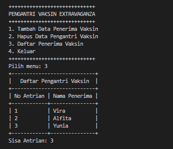

Menu (Keluar)

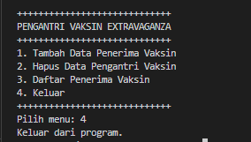

### Tugas 2 (Film Bioskop)

Kode program

Node29.java

    public class Node29 {
        int idFilm;
        String judulFilm;
        double ratingFilm;
        Node29 prev;
        Node29 next;

        public Node29(Node29 prev, int idFilm, String judulFilm, double ratingFilm, Node29 next) {
            this.prev = prev;
            this.idFilm = idFilm;
            this.judulFilm = judulFilm;
            this.ratingFilm = ratingFilm;
            this.next = next;
        }
    }

FilmBioskop29.java

    public class FilmBioskop29 {
        Node29 head;
        int size;

        public FilmBioskop29() {
            head = null;
            size = 0;
        }

        public boolean isEmpty() {
            return head == null;
        }

        public void addFirst(int idFilm, String judulFilm, double ratingFilm) {
            if (isEmpty()) {
                head = new Node29(null, idFilm, judulFilm, ratingFilm, null);
            } else {
                Node29 newNode = new Node29(null, idFilm, judulFilm, ratingFilm, head);
                head.prev = newNode;
                head = newNode;
            }
            size++;
        }

        public void addLast(int idFilm, String judulFilm, double ratingFilm) {
            if (isEmpty()) {
                addFirst(idFilm, judulFilm, ratingFilm);
            } else {
                Node29 current = head;
                while (current.next != null) {
                    current = current.next;
                }
                Node29 newNode = new Node29(current, idFilm, judulFilm, ratingFilm, null);
                current.next = newNode;
                size++;
            }
        }

        public void add(int idFilm, String judulFilm, double ratingFilm, int index) throws Exception {
            if (isEmpty()) {
                addFirst(idFilm, judulFilm, ratingFilm);
            } else if (index < 0 || index > size) {
                throw new Exception("Nilai indeks di luar batas");
            } else {
                Node29 current = head;
                int i = 0;
                while (i < index) {
                    current = current.next;
                    i++;
                }
                if (current.prev == null) {
                    Node29 newNode = new Node29(null, idFilm, judulFilm, ratingFilm, current);
                    current.prev = newNode;
                    head = newNode;
                } else {
                    Node29 newNode = new Node29(current.prev, idFilm, judulFilm, ratingFilm, current);
                    newNode.prev = current.prev;
                    newNode.next = current;
                    current.prev.next = newNode;
                    current.prev = newNode;
                }
                size++;
            }
        }

        public void print() {
            if (isEmpty()) {
                System.out.println("Tidak ada film");
            } else {
                Node29 current = head;
                while (current != null) {
                    System.out.println(current.idFilm + " " + current.judulFilm + " " + current.ratingFilm);
                    current = current.next;
                }
            }
        }

        public int size() {
            return size;
        }

        public void clear() {
            head = null;
            size = 0;
        }

        public void removeLast() throws Exception {
            if (isEmpty()) {
                throw new Exception("Linked list masih kosong, tidak dapat dihapus");
            } else if (head.next == null) {
                head = null;
                size--;
                System.out.println("Data terakhir berhasil dihapus");
                return;
            } else {
                Node29 current = head;
                while (current.next.next != null) {
                    current = current.next;
                }
                current.next = null;
                size--;
                System.out.println("Data terakhir berhasil dihapus");
            }
        }

        public void removeFirst() throws Exception {
            if (isEmpty()) {
                throw new Exception("Linked list masih kosong, tidak dapat dihapus");
            } else if (size == 1) {
                removeLast();
            } else {
                head = head.next;
                head.prev = null;
                size--;
                System.out.println("Data pertama berhasil dihapus");
            }
        }

        public void remove(int index) throws Exception {
            if (isEmpty()) {
                throw new Exception("Linked list masih kosong, tidak dapat dihapus");
            } else if (index < 0 || index >= size) {
                throw new Exception("Nilai indeks di luar batas");
            } else if (index == 0) {
                removeFirst();
            } else if (index == size - 1) {
                removeLast();
            } else {
                Node29 current = head;
                for (int i = 1; i < index; i++) {
                    current = current.next;
                }
                current.prev.next = current.next;
                current.next.prev = current.prev;
                size--;
                System.out.println("Data pada indeks " + index + " berhasil dihapus");
            }
        }

        public Node29 cariId(int id) {
            Node29 current = head;
            while (current != null) {
                if (current.idFilm == id) {
                    return current;
                }
                current = current.next;
            }
            return null;
        }

        public void SortDesc() {
            for (Node29 i = head; i != null; i = i.next) {
                for (Node29 j = i.next; j != null; j = j.next) {
                    if (i.ratingFilm < j.ratingFilm) {
                        double temp = i.ratingFilm;
                        i.ratingFilm = j.ratingFilm;
                        j.ratingFilm = temp;
                    }
                }

            }
        }
    }

FilmBioskopMain29.java

    import java.util.Scanner;

    public class FilmBioskopMain29 {
        public static void main(String[] args) throws Exception {
            FilmBioskop29 film = new FilmBioskop29();
            Scanner scan29 = new Scanner(System.in);

            while (true) {
                System.out.println("=====================================");
                System.out.println("        DATA FILM LAYAR LEBAR        ");
                System.out.println("=====================================");
                System.out.println("1. Tambah data awal");
                System.out.println("2. Tambah data akhir");
                System.out.println("3. Tambah data pada indeks tertentu");
                System.out.println("4. Hapus data pertama");
                System.out.println("5. Hapus data terakhir");
                System.out.println("6. Hapus data pada indeks tertentu");
                System.out.println("7. Cetak data");
                System.out.println("8. Cari film berdasarkan ID");
                System.out.println("9. Urutkan data rating film secara descending");
                System.out.println("10. Keluar");
                System.out.println("=====================================");
                System.out.print("Pilihan: ");
                int choice = scan29.nextInt();
                scan29.nextLine();

                switch (choice) {
                    case 1:
                        System.out.println("Masukkan Data Film Posisi Awal");
                        System.out.print("ID Film       : ");
                        int idAwal = scan29.nextInt();
                        scan29.nextLine();
                        System.out.print("Judul film    : ");
                        String judulAwal = scan29.nextLine();
                        System.out.print("Rating film   : ");
                        double ratingAwal = scan29.nextDouble();
                        film.addFirst(idAwal, judulAwal, ratingAwal);
                        break;
                    case 2:
                        System.out.println("Masukkan Data Film Posisi Akhir");
                        System.out.print("ID Film       : ");
                        int idAkhir = scan29.nextInt();
                        scan29.nextLine();
                        System.out.print("Judul film    : ");
                        String judulAkhir = scan29.nextLine();
                        System.out.print("Rating film   : ");
                        double ratingAkhir = scan29.nextDouble();
                        film.addLast(idAkhir, judulAkhir, ratingAkhir);
                        break;
                    case 3:
                        System.out.print("Index ke-: ");
                        int idx = scan29.nextInt();
                        scan29.nextLine();
                        System.out.print("ID film       : ");
                        int idIndex = scan29.nextInt();
                        scan29.nextLine();
                        System.out.print("Judul Film    : ");
                        String judulIndex = scan29.nextLine();
                        System.out.print("Rating film   : ");
                        double ratingIndex = scan29.nextDouble();
                        film.add(idIndex, judulIndex, ratingIndex, idx);
                        break;
                    case 4:
                        film.removeFirst();
                        break;
                    case 5:
                        film.removeLast();
                        break;
                    case 6:
                        System.out.print("Masukkan indeks: ");
                        int index6 = scan29.nextInt();
                        scan29.nextLine();
                        film.remove(index6);
                        break;
                    case 7:
                        film.print();
                        break;
                    case 8:
                        System.out.print("Masukkan ID film yang ingin dicari: ");
                        int searchId = scan29.nextInt();
                        Node29 ditemukan = film.cariId(searchId);
                        if (ditemukan != null) {
                            System.out.println("Film ditemukan:");
                            System.out.println("ID: " + ditemukan.idFilm);
                            System.out.println("Judul: " + ditemukan.judulFilm);
                            System.out.println("Rating: " + ditemukan.ratingFilm);
                        } else {
                            System.out.println("Film dengan ID " + searchId + " tidak ditemukan.");
                        }
                        break;
                    case 9:
                        film.SortDesc();
                        System.out.println("Data telah diurutkan berdasarkan rating secara descending.");
                        break;
                    case 10:
                        System.out.println("Terima kasih telah menggunakan program ini.");
                        System.exit(0);
                    default:
                        System.out.println("Pilihan tidak valid. Silakan pilih lagi.");
                }
            }
        }
    }

Hasil ketika dijalankan

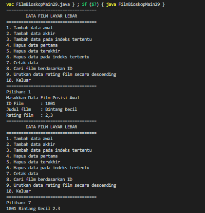
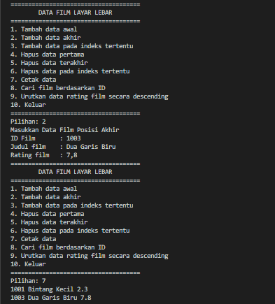
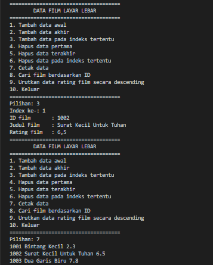
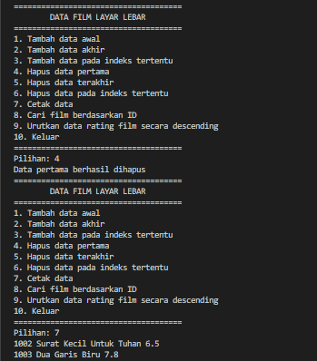
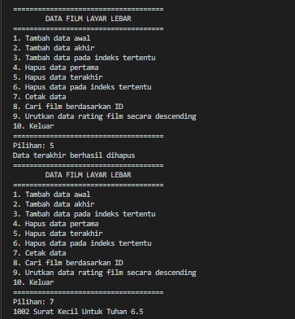
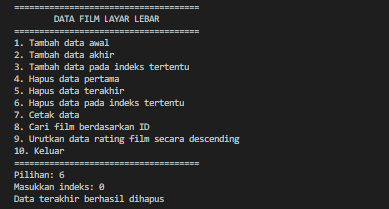
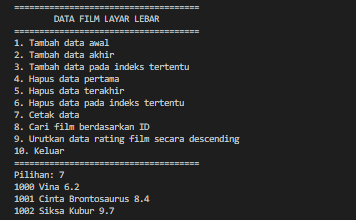
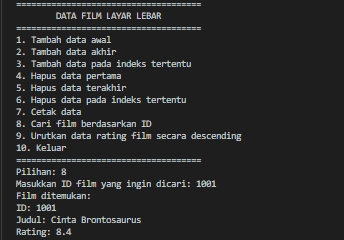
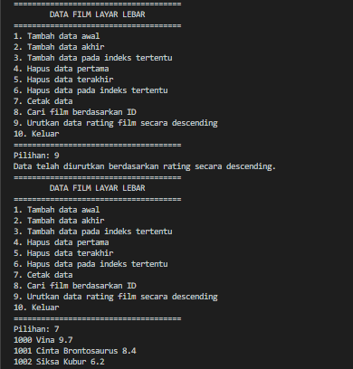
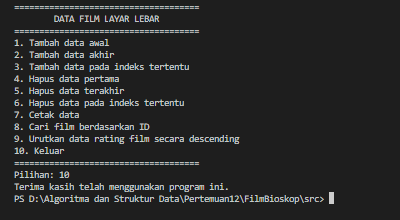
