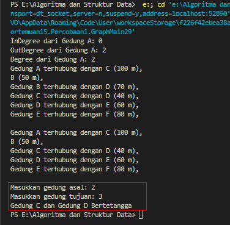
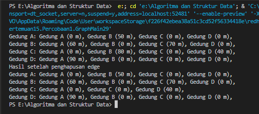
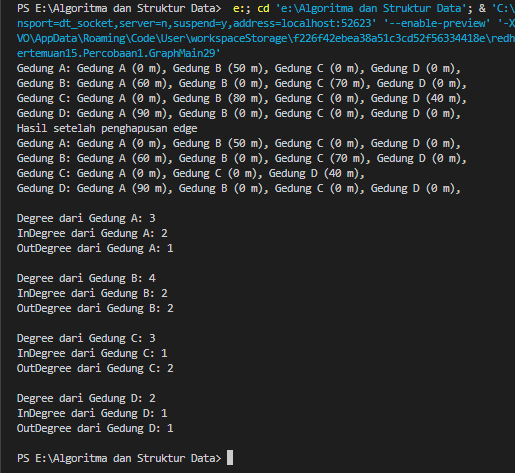
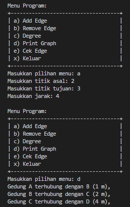
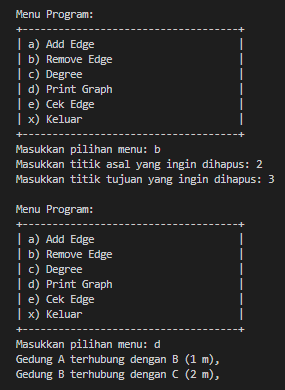
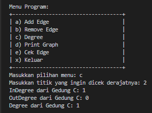
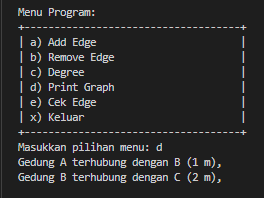
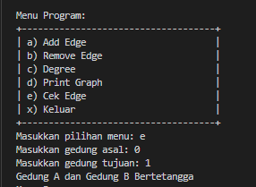

# Algoritma dan Struktur Data

Vira Alfita Yunia

TI-1B

29

2341720055

## Pertemuan 15 (Graph)

### Percobaan 1

Kode program

Node29.java

    package Pertemuan15.Percobaan1;

    public class Node29 {
        int data;
        Node29 next, prev;
        int jarak;

        public Node29(Node29 prev, int data, int jarak, Node29 next) {
            this.prev = prev;
            this.data = data;
            this.next = next;
            this.jarak = jarak;
        }
    }

DoubleLinkedLists29.java

    package Pertemuan15.Percobaan1;

    public class DoubleLinkedLists29 {
        Node29 head;
        int size;

        public DoubleLinkedLists29() {
            head = null;
            size = 0;
        }

        public boolean isEmpty() {
            return head == null;
        }

        public void addFirst(int item, int jarak) {
            if (isEmpty()) {
                head = new Node29(null, item, jarak, null);
            } else {
                Node29 newNode = new Node29(null, item, jarak, head);
                head.prev = newNode;
                head = newNode;
            }
            size++;
        }

        public void addLast(int item, int jarak) {
            if (isEmpty()) {
                addFirst(item, jarak);
            } else {
                Node29 current = head;
                while (current.next != null) {
                    current = current.next;
                }
                Node29 newNode = new Node29(current, item, jarak, null);
                current.next = newNode;
                size++;
            }
        }

        public void add(int item, int index, int jarak) throws Exception {
            if (isEmpty()) {
                addFirst(item, jarak);
            } else if (index < 0 || index > size) {
                throw new Exception("Nilai indeks di luar batas");
            } else {
                Node29 current = head;
                int i = 0;
                while (i < index) {
                    current = current.next;
                    i++;
                }
                if (current.prev == null) {
                    Node29 newNode = new Node29(null, item, jarak, current);
                    current.prev = newNode;
                    head = newNode;
                } else {
                    Node29 newNode = new Node29(current.prev, item, jarak, current);
                    newNode.prev = current.prev;
                    newNode.next = current;
                    current.prev.next = newNode;
                    current.prev = newNode;
                }
                size++;
            }
        }

        public int size() {
            return size;
        }

        public void clear() {
            head = null;
            size = 0;
        }

        public void print() {
            if (!isEmpty()) {
                Node29 tmp = head;
                while (tmp != null) {
                    System.out.print(tmp.data + "\t");
                    tmp = tmp.next;
                }
                System.out.println("\nBerhasil diisi");
            } else {
                System.out.println("Linked Lists Kosong");
            }
        }

        public void removeLast() throws Exception {
            if (isEmpty()) {
                throw new Exception("Linked Lists masih kosong, tidak dapat dihapus!");
            } else if (head.next == null) {
                head = null;
                size--;
                return;
            }
            Node29 current = head;
            while (current.next.next != null) {
                current = current.next;
            }
            current.next = null;
            size--;
        }

        public void removeFirst() throws Exception {
            if (isEmpty()) {
                throw new Exception("Linked Lists masih kosong, tidak dapat dihapus!");
            } else if (size == 1) {
                removeLast();
            } else {
                head = head.next;
                head.prev = null;
                size--;
            }
        }

        public void remove(int index) throws Exception {
            Node29 current = head;
            while (current != null) {
                if (current.data == index) {
                    if (current.prev != null) {
                        current.prev.next = current.next;
                    } else {
                        head = current.next;
                    }
                }
                if (current.next != null) {
                    current.next.prev = current.prev;
                }
                break;
            }
            current = current.next;
            size--;
        }

        public int getFirst() throws Exception {
            if (isEmpty()) {
                throw new Exception("Linked Lists masih kosong");
            }
            return head.data;
        }

        public int getLast() throws Exception {
            if (isEmpty()) {
                throw new Exception("Linked Lists masih kosong");
            }
            Node29 tmp = head;
            while (tmp.next != null) {
                tmp = tmp.next;
            }
            return tmp.data;
        }

        public int get(int index) throws Exception {
            if (isEmpty() || index >= size) {
                throw new Exception("Nilai indeks di luar batas");
            }
            Node29 tmp = head;
            for (int i = 0; i < index; i++) {
                tmp = tmp.next;
            }
            return tmp.data;
        }

        public int getJarak(int index) throws Exception {
            if (isEmpty() || index >= size) {
                throw new Exception("Nilai indeks di luar batas");
            }
            Node29 tmp = head;
            for (int i = 0; i < index; i++) {
                tmp = tmp.next;
            }
            return tmp.jarak;
        }
    }

Graph29.java

    package Pertemuan15.Percobaan1;

    public class Graph29 {
        int vertex;
        DoubleLinkedLists29 list[];

        public Graph29(int v) {
            vertex = v;
            list = new DoubleLinkedLists29[v];
            for (int i = 0; i < v; i++) {
                list[i] = new DoubleLinkedLists29();
            }
        }

        public void addEdge(int asal, int tujuan, int jarak) {
            list[asal].addFirst(tujuan, jarak);
        }

        public void degree(int asal) throws Exception {
            int k, totalIn = 0, totalOut = 0;
            for (int i = 0; i < vertex; i++) {
                // inDegree
                for (int j = 0; j < list[i].size(); j++) {
                    if (list[i].get(j) == asal) {
                        ++totalIn;
                    }
                }

                // outDegree
                for (k = 0; k < list[asal].size(); k++) {
                    list[asal].get(k);
                }
                totalOut = k;
            }

            System.out.println("InDegree dari Gedung " + (char) ('A' + asal) + ": " + totalIn);
            System.out.println("OutDegree dari Gedung " + (char) ('A' + asal) + ": " + totalOut);
            System.out.println("Degree dari Gedung " + (char) ('A' + asal) + ": " + (totalOut + totalIn));
        }

        public void removeEdge(int asal, int tujuan) throws Exception {
            for (int i = 0; i < vertex; i++) {
                if (i == tujuan) {
                    list[asal].remove(tujuan);
                }
            }
        }

        public void removeAllEdges() {
            for (int i = 0; i < vertex; i++) {
                list[i].clear();
            }
            System.out.println("Graph berhasil dikosongkan");
        }

        public void printGraph() throws Exception {
            for (int i = 0; i < vertex; i++) {
                if (list[i].size() > 0) {
                    System.out.print("Gedung " + (char) ('A' + i) + " terhubung dengan ");
                    for (int j = 0; j < list[i].size(); j++) {
                        System.out.println((char) ('A' + list[i].get(j)) + " (" + list[i].getJarak(j) + " m), ");
                    }
                }
            }
            System.out.println("");
        }
    }

GraphMain29.java

    package Pertemuan15.Percobaan1;

    public class GraphMain29 {
        public static void main(String[] args) throws Exception {
            Graph29 gedung = new Graph29(6);
            gedung.addEdge(0, 1, 50);
            gedung.addEdge(0, 2, 100);
            gedung.addEdge(1, 3, 70);
            gedung.addEdge(2, 3, 40);
            gedung.addEdge(3, 4, 60);
            gedung.addEdge(4, 5, 80);
            gedung.degree(0);
            gedung.printGraph();
            gedung.removeEdge(1, 3);
            gedung.printGraph();
        }

    }

Hasil ketika dijalankan

Hasil running pada langkah 14 

Hasil running pada langkah 17 

#### Pertanyaan

<strong>
Perbaiki kode program Anda apabila terdapat error atau hasil kompilasi kode tidak sesuai!
</strong>

Kode program yang tidak sesuai sudah diperbaiki. Ada beberapa method yang salah penulisan dan tidak sesuai dengan contoh yang diberikan sehingga terjadi error.

<strong>
Pada class Graph, terdapat atribut list[] bertipe DoubleLinkedList. Sebutkan tujuan pembuatan
variabel tersebut!
</strong>

 Variabel list[] digunakan untuk membantu program menyimpan dan mengatur bagaimana titik-titik dalam graf saling terhubung.

<strong>
Jelaskan alur kerja dari method removeEdge!
</strong>

Metode removeEdge bertugas untuk menghapus sambungan (edge) antara dua titik dalam graf. Pertama, metode memeriksa setiap titik dalam graf. Jika titik yang sedang diperiksa sama dengan titik tujuan yang ingin dihapus, metode akan menghapus sambungan dari titik asal ke titik tujuan tersebut. Dengan kata lain, metode menghilangkan jalur langsung antara dua titik, sehingga mereka tidak lagi terhubung satu sama lain dalam graf.

<strong>
Apakah alasan pemanggilan method addFirst() untuk menambahkan data, bukan method add
jenis lain saat digunakan pada method addEdge pada class Graph?
</strong>

Pemanggilan method addFirst() digunakan untuk memastikan bahwa simpul tujuan yang baru ditambahkan akan menjadi elemen pertama dalam daftar berdekatan, sehingga memungkinkan akses yang lebih cepat ke simpul tersebut saat diperlukan.

<strong>
Modifikasi kode program sehingga dapat dilakukan pengecekan apakah terdapat jalur antara
suatu node dengan node lainnya, seperti contoh berikut (Anda dapat memanfaatkan Scanner).
</strong>

Kode untuk mengecek apakah antar node bertetangga atau tidak pada class Graph29

    public void isTetanggaDekat() throws Exception {
        Scanner scan29 = new Scanner(System.in);
        System.out.print("Masukkan gedung asal: ");
        int asal = scan29.nextInt();
        System.out.print("Masukkan gedung tujuan: ");
        int tujuan = scan29.nextInt();

        if (list[asal].size() > 0) {
            for (int i = 0; i < list[asal].size(); i++) {
                int nextNode = list[asal].get(i);
                if (nextNode == tujuan) {
                    System.out
                            .print("Gedung " + (char) ('A' + asal) + " dan Gedung " + (char) ('A' + tujuan)
                                    + " Bertetangga");
                } else {
                    System.out
                            .print("Gedung " + (char) ('A' + asal) + " dan Gedung " + (char) ('A' + tujuan)
                                    + " Tidak Bertetangga");
                }
            }
        }
    }

Hasil ketika dijalankan

### Percobaan 2

Kode program

GraphMatrix29.java

    package Pertemuan15.Percobaan1;

    public class GraphMatrix29 {
        int vertex;
        int[][] matriks;

        public GraphMatrix29(int v) {
            vertex = v;
            matriks = new int[v][v];
        }

        public void makeEdge(int asal, int tujuan, int jarak) {
            matriks[asal][tujuan] = jarak;
        }

        public void removeEdge(int asal, int tujuan) {
            matriks[asal][tujuan] = -1;
        }

        public void printGraph() {
            for (int i = 0; i < vertex; i++) {
                System.out.print("Gedung " + (char) ('A' + i) + ": ");
                for (int j = 0; j < vertex; j++) {
                    if (matriks[i][j] != -1) {
                        System.out.print("Gedung " + (char) ('A' + j) + " (" + matriks[i][j] + " m), ");
                    }
                }
                System.out.println();
            }
        }
    }

GraphMain29.java

    package Pertemuan15.Percobaan1;

    public class GraphMain29 {
        public static void main(String[] args) throws Exception {
            GraphMatrix29 gdg = new GraphMatrix29(4);
            gdg.makeEdge(0, 1, 50);
            gdg.makeEdge(1, 0, 60);
            gdg.makeEdge(1, 2, 70);
            gdg.makeEdge(2, 1, 80);
            gdg.makeEdge(2, 3, 40);
            gdg.makeEdge(3, 0, 90);
            gdg.printGraph();
            System.out.println("Hasil setelah penghapusan edge");
            gdg.removeEdge(2, 1);
            gdg.printGraph();
        }

    }

Hasil ketika dijalankan

#### Pertanyaan

<strong>
Perbaiki kode program Anda apabila terdapat error atau hasil kompilasi kode tidak sesuai!
</strong>

Kode program sudah sesuai.

<strong>
Apa jenis graph yang digunakan pada Percobaan 2?
</strong>

Jenis graph pada percobaan tersebut adalah directed graph dikarenakan setiap tepi (edge) memiliki arah tertentu, yaitu dari satu titik awal (source) ke titik tujuan (destination). 

<strong>
Apa maksud dari dua baris kode berikut?
</strong>

Dua baris kode tersebut digunakan untuk menambahkan edge baru.

<strong>
Modifikasi kode program sehingga terdapat method untuk menghitung degree, termasuk inDegree dan outDegree!
</strong>

    public int degree(int node) {
        return inDegree(node) + outDegree(node);
    }

    public int outDegree(int asal) {
        int outDegree = 0;
        for (int i = 0; i < vertex; i++) {
            if (matriks[asal][i] != 0) {
                outDegree++;
            }
        }
        return outDegree;
    }

    public int inDegree(int asal) {
        int inDegree = 0;
        for (int i = 0; i < vertex; i++) {
            if (matriks[i][asal] != 0) {
                inDegree++;
            }
        }
        return inDegree;
    }

Hasil ketika dijalankan

### Tugas

<strong>
Modifikasi kode program pada class GraphMain sehingga terdapat menu program yang bersifat
dinamis, setidaknya terdiri dari:
a) Add Edge
b) Remove Edge
c) Degree
d) Print Graph
e) Cek Edge
Pengguna dapat memilih menu program melalui input Scanner
</strong>

Kode program GraphMain setelah ditambahkan menu scanner

    package Pertemuan15.Percobaan1;

    import java.util.Scanner;

    public class GraphMain29 {
    public static void main(String[] args) throws Exception {
    Graph29 gedung = new Graph29(6);
    Scanner scanner = new Scanner(System.in);

        System.out.println("+------------------------------------+");
        System.out.println("|        Selamat Datang di           |");
        System.out.println("|          Graph Vira                |");
        System.out.println("+------------------------------------+");
        boolean exit = false;
        while (!exit) {
            System.out.println("\nMenu Program:");
            System.out.println("+------------------------------------+");
            System.out.println("| a) Add Edge                        |");
            System.out.println("| b) Remove Edge                     |");
            System.out.println("| c) Degree                          |");
            System.out.println("| d) Print Graph                     |");
            System.out.println("| e) Cek Edge                        |");
            System.out.println("| x) Keluar                          |");
            System.out.println("+------------------------------------+");

            System.out.print("Masukkan pilihan menu: ");
            String menu = scanner.next();

            switch (menu.toLowerCase()) {
                case "a":
                    System.out.print("Masukkan titik asal: ");
                    int asal = scanner.nextInt();
                    System.out.print("Masukkan titik tujuan: ");
                    int tujuan = scanner.nextInt();
                    System.out.print("Masukkan jarak: ");
                    int jarak = scanner.nextInt();
                    gedung.addEdge(asal, tujuan, jarak);
                    break;
                case "b":
                    System.out.print("Masukkan titik asal yang ingin dihapus: ");
                    int asalHapus = scanner.nextInt();
                    System.out.print("Masukkan titik tujuan yang ingin dihapus: ");
                    int tujuanHapus = scanner.nextInt();
                    gedung.removeEdge(asalHapus, tujuanHapus);
                    break;
                case "c":
                    System.out.print("Masukkan titik yang ingin dicek derajatnya: ");
                    int titik = scanner.nextInt();
                    gedung.degree(titik);
                    break;
                case "d":
                    gedung.printGraph();
                    break;
                case "e":
                    gedung.isTetanggaDekat();
                    break;
                case "x":
                    exit = true;
                default:
                    System.out.println("Pilihan tidak valid. Silakan pilih kembali.");
            }
        }

    }

Hasil ketika dijalankan

<strong>
Tambahkan method updateJarak pada Percobaan 1 yang digunakan untuk mengubah jarak antara dua node asal dan tujuan
</strong>

    public void updateJarak(int asal, int tujuan, int newJarak) throws Exception {
        boolean updated = false;
        for (int i = 0; i < list[asal].size(); i++) {
            if (list[asal].get(i) == tujuan) {
                list[asal].updateJarak(i, newJarak);
                updated = true;
                break;
            }
        }
        if (updated) {
            System.out.println("Jarak dari Gedung " + (char) ('A' + asal) + " ke Gedung " + (char) ('A' + tujuan)
                    + " berhasil diperbarui menjadi " + newJarak + " m");
        } else {
            System.out.println("Edge dari Gedung " + (char) ('A' + asal) + " ke Gedung " + (char) ('A' + tujuan)
                    + " tidak ditemukan");
        }
    }

GraphMain

            System.out.println("\nMenu Program:");
            System.out.println("+------------------------------------+");
            System.out.println("| a) Add Edge                        |");
            System.out.println("| b) Remove Edge                     |");
            System.out.println("| c) Degree                          |");
            System.out.println("| d) Print Graph                     |");
            System.out.println("| e) Cek Edge                        |");
            System.out.println("| f) Update Jarak                    |");
            System.out.println("| x) Keluar                          |");
            System.out.println("+------------------------------------+");

            System.out.print("Masukkan pilihan menu: ");
            String menu = scanner.next();

        case "f":
                    System.out.print("Masukkan titik asal: ");
                    int asalUbah = scanner.nextInt();
                    System.out.print("Masukkan titik tujuan: ");
                    int tujuanUbah = scanner.nextInt();
                    System.out.print("Masukkan jarak baru: ");
                    int jarakUbah = scanner.nextInt();
                    gedung.updateJarak(asalUbah, tujuanUbah, jarakUbah);
                    break;

Hasil ketika dijalankan

<strong>
Tambahkan method hitungEdge untuk menghitung banyaknya edge yang terdapat di dalam graf!
</strong>

    public int hitungEdge() {
        int jmlEdge = 0;
        for (int i = 0; i < vertex; i++) {
            jmlEdge += list[i].size();
        }
        return jmlEdge;
    }

GraphMain

            System.out.println("\nMenu Program:");
            System.out.println("+------------------------------------+");
            System.out.println("| a) Add Edge                        |");
            System.out.println("| b) Remove Edge                     |");
            System.out.println("| c) Degree                          |");
            System.out.println("| d) Print Graph                     |");
            System.out.println("| e) Cek Edge                        |");
            System.out.println("| f) Update Jarak                    |");
            System.out.println("| g) Hitung Edge                     |");
            System.out.println("| x) Keluar                          |");
            System.out.println("+------------------------------------+");

            System.out.print("Masukkan pilihan menu: ");
            String menu = scanner.next();

         case "g":
                    System.out.print("Jumlah Edge: " + gedung.hitungEdge());
                    break;

Hasil ketika dijalankan

