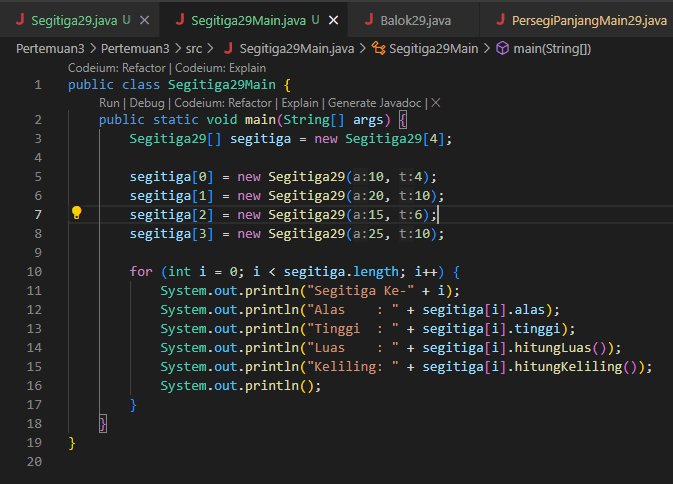

# Algoritma dan Struktur Data

Vira Alfita Yunia

TI-1B

29

2341720055

## Pertemuan 3 (Object of Array)

### Percobaan 1

Kode program

Hasil ketika dijalankan

#### Pertanyaan

<strong>
Berdasarkan uji coba 3.2, apakah class yang akan dibuat array of object harus selalu memiliki atribut dan sekaligus method? Jelaskan!
</strong>

 Berdasarkan uji coba tersebut, sebuah class yang dibuat array of object hanya memiliki atribut saja. Melalui percobaan ini dapat disimpulkan bahwa penggunaan sebuah class tidak harus memiliki atribut atau method, penggunaan dua hal tersebut dapat dibuat sesuai kebutuhan pengguna saja.

<strong>
Apakah class PersegiPanjang memiliki konstruktor? Jika tidak, kenapa dilakukan pemanggilan
konstruktur pada baris program berikut :
</strong>

Class PersegiPanjang tidak memiliki konstruktor. Pemanggilan konstruktor ditujukan pada konstruktor default yang memang sudah disediakan oleh Java. Jika tidak ada konstruktor yang didefinisikan dalam suatu class, maka Java akan menyediakan konstruktor default atau tanpa parameter secara otomatis.

<strong>
Apa yang dimaksud dengan kode berikut ini:
</strong>

Kode tersebut menjelaskan instansiasi object array yang menampung tiga object dari class PersegiPanjang.

<strong>
Apa yang dimaksud dengan kode berikut ini:
</strong>

Kode tersebut merupakan instansiasi object dan penambahan nilai ke sebuah variabel array.

<strong>
Mengapa class main dan juga class PersegiPanjang dipisahkan pada uji coba 3.2?
</strong>

Agar pengkodean bisa lebih terstruktur dan mudah untuk dipahami.

### Percobaan 2

Kode program

Hasil ketika dijalankan

#### Pertanyaan

<strong>
Berdasarkan uji coba 3.2, apakah class yang akan dibuat array of object harus selalu memiliki atribut dan sekaligus method? Jelaskan!
</strong>

Ya, bisa

<strong>
Jika jawaban soal no satu iya, berikan contohnya! Jika tidak, jelaskan!
</strong>

Contoh Kode program

Hasil ketika dijalankan

<strong>
Jika diketahui terdapat class Persegi yang memiliki atribut sisi bertipe integer, maka kode
dibawah ini akan memunculkan error saat dijalankan. Mengapa?
</strong>

Karena array tersebut sudah dideklarasikan dengan panjang 100, tetapi elemen-elemennya masih null, sehingga ketika dijalankan akan menampilkan NullPointerException

<strong>
Modifikasi kode program pada praktikum 3.3 agar length array menjadi inputan dengan Scanner!
</strong>

Kode program

Hasil ketika dijalankan

<strong>
Apakah boleh Jika terjadi duplikasi instansiasi array of objek, misalkan saja instansiasi dilakukan
pada ppArray[i] sekaligus ppArray[0]?Jelaskan !
</strong>

Boleh, tidak ada aturan yang melarang duplikasi instansiasi array of objek pada indeks yang sama atau berbeda. Dengan kata lain, Anda dapat menginisialisasi elemen-elemen array dengan objek yang sama pada indeks yang sama tanpa masalah sintaks.

### Percobaan 3

Kode program

Hasil ketika dijalankan

#### Pertanyaan

<strong>
Dapatkah konstruktor berjumlah lebih dalam satu kelas? Jelaskan dengan contoh
</strong>

Ya, bisa

<strong>
Soal No 3-5
</strong>

