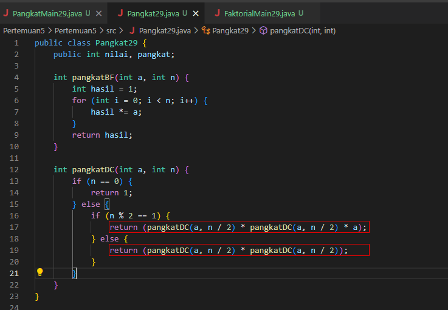
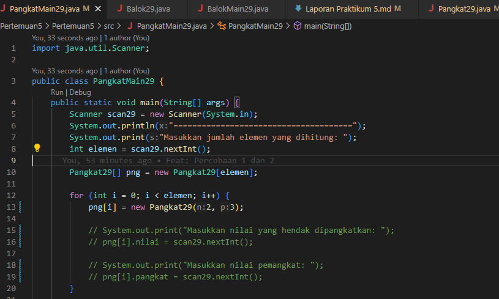

# Algoritma dan Struktur Data

Vira Alfita Yunia

TI-1B

29

2341720055

## Pertemuan 5 (BRUTE FORCE DAN DIVIDE CONQUER)

### Percobaan 1

Kode program

Hasil ketika dijalankan

#### Pertanyaan

<strong>
Pada base line Algoritma Divide Conquer untuk melakukan pencarian nilai faktorial, jelaskan
perbedaan bagian kode pada penggunaan if dan else!
</strong>

if digunakan pada saat nilai elemen = 0, maka direturnkan 1 dikarenakan hasil pangkat 0 sudah pasti 1, sedangkan else digunakan jika nilai tidak sama dengan = 0, maka dilakukan operasi faktorial dari nilai elemen tersebut

<strong>
Apakah memungkinkan perulangan pada method faktorialBF() dirubah selain menggunakan for? Buktikan!
</strong>

Bisa saja, di sini saya mengganti dengan perulangan while

<strong>
Jelaskan perbedaan antara fakto = i; dan int fakto = n faktorialDC(n-1); !
</strong>

Penggunaan fakto *= i maka kita menjumlah hasil dari kali semua faktorial berdasarkan index, misalkan = 4! = 4.1 + 4.2 + 4.3

Jika int fakto = n * faktorialDC(n-1); maka kita menghitung faktorial menggunakan fungsi rekursif dan memanggil fungsi itu sendiri sampai kondisi n = 0, misalkan = 4! = 4.3.2.1

### Percobaan 2

Kode program

Hasil ketika dijalankan

#### Pertanyaan

<strong>
Jelaskan mengenai perbedaan 2 method yang dibuat yaitu PangkatBF() dan PangkatDC()!
</strong>

Pangkat BF digunakan untuk menghitung perpangkatan menggunakan algoritma Brute Force, sedangkan PangkatDC() digunakan untuk menghitung perpangkatan menggunakan algoritma Divide and Conquer

<strong>
Apakah tahap combine sudah termasuk dalam kode tersebut?Tunjukkan!
</strong>

Tahap combine sudah termasuk dalam kode tersebut, dijalankan ketika kita mengalikan hasil dari submasalah untuk menghasilkan hasil akhir.

<strong>
Modifikasi kode program tersebut, anggap proses pengisian atribut dilakukan dengan konstruktor!
</strong>

<strong>
Tambahkan menu agar salah satu method yang terpilih saja yang akan dijalankan menggunakan switch-case!
</strong>

### Percobaan 3

Kode program

Hasil ketika dijalankan

#### Pertanyaan

<strong>
Mengapa terdapat formulasi return value berikut? Jelaskan!
</strong>

Karena formulasi tersebut digunakan untuk menjumlah semua perhitungan dengan metode combine.

<strong>
Kenapa dibutuhkan variable mid pada method TotalDC()?
</strong>

Variabel mid digunakan untuk menandai nilai tengah dari hasil divide pada array.

<strong>
Program perhitungan keuntungan suatu perusahaan ini hanya untuk satu perusahaan saja.
Bagaimana cara menghitung sekaligus keuntungan beberapa bulan untuk beberapa
perusahaan.(Setiap perusahaan bisa saja memiliki jumlah bulan berbeda-beda)? Buktikan
dengan program!
</strong>

Variabel mid digunakan untuk menandai nilai tengah dari hasil divide pada array.

<strong>
Program perhitungan keuntungan suatu perusahaan ini hanya untuk satu perusahaan saja.
Bagaimana cara menghitung sekaligus keuntungan beberapa bulan untuk beberapa
perusahaan.(Setiap perusahaan bisa saja memiliki jumlah bulan berbeda-beda)? Buktikan
dengan program!
</strong>

Hasil Modifikasi

### Latihan Praktikum

Kode program

Hasil ketika dijalankan

