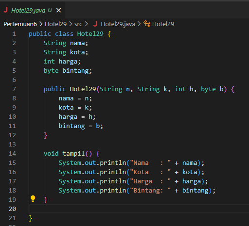

# Algoritma dan Struktur Data

Vira Alfita Yunia

TI-1B

29

2341720055

## Pertemuan 6 (Sorting)

### Percobaan Bubble Sort

Kode program

Hasil ketika dijalankan

#### Pertanyaan

<strong>
Terdapat di method apakah proses bubble sort?
</strong>

Method bubbleSort() pada class DaftarMahasiswaBerprestasi29

<strong>
Di dalam method bubbleSort(), terdapat baris program seperti di bawah ini, Untuk apakah proses tersebut?
</strong>

Pertanyaan tersebut menanyakan tentang proses penukaran dua elemen dalam array yang terjadi di dalam method bubbleSort(). Proses ini bertujuan untuk mengurutkan elemen-elemen dalam array berdasarkan nilai ipk dari yang terkecil hingga yang terbesar.

<strong>
Perhatikan perulangan di dalam bubbleSort() di bawah ini:
</strong>
<strong>
a. Apakah perbedaan antara kegunaan perulangan i dan perulangan j?
</strong>

    Perulangan i: Digunakan untuk mengiterasi setiap elemen dalam array listMhs. Perulangan ini memastikan bahwa semua elemen dibandingkan dengan elemen di sebelahnya.
    Perulangan j: Digunakan untuk mengontrol berapa kali perbandingan dan penukaran elemen dilakukan. Perulangan ini berhenti ketika tidak ada lagi elemen yang perlu ditukar, yaitu ketika array sudah terurut.

<strong>
b. Mengapa syarat dari perulangan i adalah i kurang dari listMhs.length-1? 
</strong>

Syarat ini memastikan bahwa perulangan i tidak mengakses elemen di luar array. Elemen terakhir dalam array memiliki indeks listMhs.length-1, sehingga perulangan harus berhenti sebelum mencapai indeks tersebut.

<strong>
c. Mengapa syarat dari perulangan j adalah j kurang dari listMhs.length-i?
</strong>

Syarat ini memastikan bahwa perbandingan dan penukaran elemen hanya dilakukan pada elemen-elemen yang belum terurut. Elemen-elemen yang berada di akhir array sudah terurut setelah perulangan sebelumnya, sehingga tidak perlu dibandingkan lagi.

<strong>
d. Jika banyak data di dalam listMhs adalah 50, maka berapakali perulangan i akan berlangsung? Dan ada berapa Tahap bubble sort yang ditempuh?
</strong>

Perulangan i akan berlangsung sebanyak 50 - 1 = 49 kali.

Jumlah tahap bubble sort tidak dapat ditentukan secara pasti. Tahap bubble sort akan berhenti ketika array sudah terurut. Dalam kasus terburuk, bubble sort membutuhkan listMhs.length - 1 tahap untuk mengurutkan seluruh elemen. Dalam kasus ini, bubble sort membutuhkan 49 tahap untuk mengurutkan seluruh elemen.

### Percobaan Selection Sort

Kode program

Hasil ketika dijalankan

#### Pertanyaaan

<strong>
Di dalam method selection sort, terdapat baris program seperti di bawah ini:
</strong>
<strong>
Untuk apakah proses tersebut, jelaskan!
</strong>

Kode tersebut merupakan implementasi algoritma selection sort yang digunakan untuk mengurutkan array dari objek Mahasiswa29 berdasarkan nilai IPK mereka. Setiap iterasi dari algoritma ini mencari nilai IPK terkecil dari elemen-elemen yang belum diurutkan, dan kemudian menukar posisi elemen dengan nilai IPK terkecil tersebut dengan elemen pada posisi yang tepat. Hal ini dilakukan dengan cara mengiterasi melalui array, membandingkan nilai IPK setiap elemen, dan memperbarui indeks dengan nilai IPK terkecil yang ditemukan.

### Percobaan Insertion Sort

Kode program

Hasil ketika dijalankan

#### Pertanyaaan

<strong>
Ubahlah fungsi pada InsertionSort sehingga fungsi ini dapat melaksanakan proses sorting dengan cara descending.
</strong>

Kode program

Hasil ketika dijalankan

### Latihan Praktikum

<strong>
Sebuah platform travel yang menyediakan layanan pemesanan kebutuhan travelling sedang
mengembangkan backend untuk sistem pemesanan/reservasi akomodasi (penginapan), salah
satu fiturnya adalah menampilkan daftar penginapan yang tersedia berdasarkan pilihan filter
yang diinginkan user. Daftar penginapan ini harus dapat disorting berdasarkan

1. Harga dimulai dari harga termurah ke harga tertinggi.
2. Rating bintang penginapan dari bintang tertinggi (5) ke terendah (1)
   Buatlah proses sorting data untuk kedua filter tersebut dengan menggunakan algoritma
   bubble sort dan selection sort.
</strong>

Kode program

Hasil ketika dijalankan

