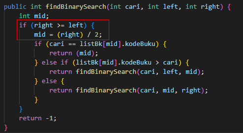
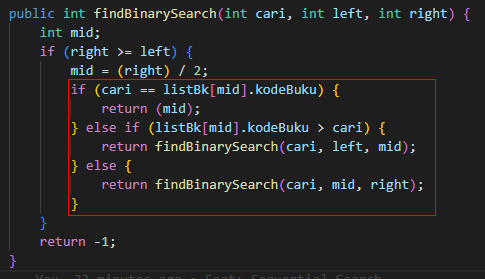

# Algoritma dan Struktur Data

Vira Alfita Yunia

TI-1B

29

2341720055

## Pertemuan 6 (Sorting)

### Percobaan Sequential Search

Kode program

Hasil ketika dijalankan

#### Pertanyaan

<strong>
Jelaskan fungsi break yang ada pada method FindSeqSearch!
</strong>

Fungsi dari break adalah untuk menghentikan perulangan saat nilai yang dicari sudah ditemukan.

<strong>
Jika Data Kode Buku yang dimasukkan tidak terurut dari kecil ke besar. Apakah program masih
dapat berjalan? Apakah hasil yang dikeluarkan benar? Tunjukkan hasil screenshoot untuk bukti
dengan kode Buku yang acak. Jelaskan Mengapa hal tersebut bisa terjadi?
</strong>

Bisa, karena sequential search membandingkan data dengan keyword yang dicari pada setiap indeks tanpa perlu dilakukan sorting dahulu untuk mencari data

<strong>
Buat method baru dengan nama FindBuku menggunakan konsep sequential search dengan tipe
method dari FindBuku adalah BukuNoAbsen. Sehingga Anda bisa memanggil method
tersebut pada class BukuMain seperti gambar berikut 
</strong>

### Percobaan Sequential Search

Kode program

Hasil ketika dijalankan

#### Pertanyaan

<strong>
Tunjukkan pada kode program yang mana proses divide dijalankan!
</strong>

<strong>
Tunjukkan pada kode program yang mana proses conquer dijalankan!
</strong>

<strong>
Jika data Kode Buku yang dimasukkan tidak urut. Apakah program masih dapat berjalan? Mengapa
demikian! Tunjukkan hasil screenshoot untuk bukti dengan kode Buku yang acak. Jelaskan
Mengapa hal tersebut bisa terjadi?
</strong>

Sequential search akan berjalan, namun untuk binary search terjadi error

Hal ini dikarenakan kode buku yang dimasukkan tidak terurut sehingga program tidak bisa mencari data yang sesuai dengan binary search.

<strong>
Jika Kode Buku yang dimasukkan dari Kode Buku terbesar ke terkecil (missal : 20215, 20214,
20212, 20211, 20210) dan elemen yang dicari adalah 20210. Bagaimana hasil dari binary search?
Apakah sesuai? Jika tidak sesuai maka ubahlah kode program binary seach agar hasilnya sesuai!
</strong>

Tidak sesuai, berikut adalah perubahan kodenya

Hal ini dikarenakan kode buku yang dimasukkan tidak terurut sehingga program tidak bisa mencari data yang sesuai dengan binary search.

### Percobaan Merge Sort

Kode program

Hasil ketika dijalankan

### Latihan Praktikum

#### No. 1

Kode program

Hasil ketika dijalankan

#### No. 2

Kode program

Hasil ketika dijalankan

