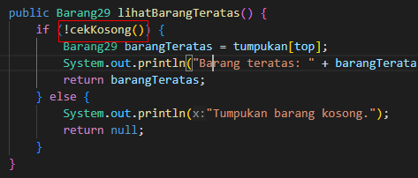
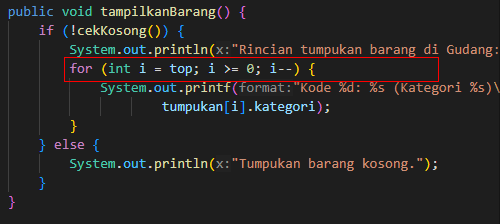
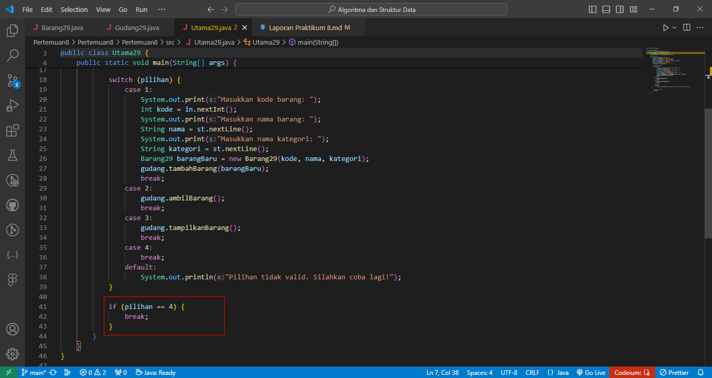

# Algoritma dan Struktur Data

Vira Alfita Yunia

TI-1B

29

2341720055

## Pertemuan 8 (Stack)

### Percobaan 1

Kode program

Barang29.java

    public class Barang29 {
        int kode;
        String nama, kategori;

        public Barang29(int kode, String nama, String kategori) {
            this.kode = kode;
            this.nama = nama;
            this.kategori = kategori;
        }

    }

Gudang29.java

    public class Gudang29 {
    Barang29[] tumpukan;
    int size, top;

        public Gudang29(int kapasitas) {
            size = kapasitas;
            tumpukan = new Barang29[size];
            top = -1;
        }

        public boolean cekKosong() {
            if (top == -1) {
                return true;
            } else {
                return false;
            }
        }

        public boolean cekPenuh() {
            if (top == size - 1) {
                return true;
            } else {
                return false;
            }
        }

        public void tambahBarang(Barang29 brg) {
            if (!cekPenuh()) {
                top++;
                tumpukan[top] = brg;
                System.out.println("Barang " + brg.nama + " berhasil ditambahkan ke Gudang");
            } else {
                System.out.println("Gagal! Tumpukan barang di Gudang sudah penuh");
            }
        }

        public Barang29 ambilBarang() {
            if (!cekKosong()) {
                Barang29 delete = tumpukan[top];
                top--;
                System.out.println("Barang " + delete.nama + " diambil dari Gudang.");
                return delete;
            } else {
                System.out.println("Tumpukan barang kosong.");
                return null;
            }
        }

        public Barang29 lihatBarangTeratas() {
            if (!cekKosong()) {
                Barang29 barangTeratas = tumpukan[top];
                System.out.println("Barang teratas: " + barangTeratas.nama);
                return barangTeratas;
            } else {
                System.out.println("Tumpukan barang kosong.");
                return null;
            }
        }

        public void tampilkanBarang() {
            if (!cekKosong()) {
                System.out.println("Rincian tumpukan barang di Gudang: ");
                for (int i = top; i >= 0; i--) {
                    System.out.printf("Kode %d: %s (Kategori %s)\n", tumpukan[i].kode, tumpukan[i].nama,
                            tumpukan[i].kategori);
                }
            } else {
                System.out.println("Tumpukan barang kosong.");
            }
        }

    }

Utama29.java

    import java.util.Scanner;

    public class Utama29 {
    public static void main(String[] args) {
    Scanner st = new Scanner(System.in);
    Scanner in = new Scanner(System.in);
    Gudang29 gudang = new Gudang29(5);

            while (true) {
                System.out.println("\nMenu:");
                System.out.println("1. Tambah barang");
                System.out.println("2. Ambil barang");
                System.out.println("3. Tampilkan tumpukan barang");
                System.out.println("4. Keluar");
                System.out.print("Pilih Operasi: ");
                int pilihan = in.nextInt();

                switch (pilihan) {
                    case 1:
                        System.out.print("Masukkan kode barang: ");
                        int kode = in.nextInt();
                        System.out.print("Masukkan nama barang: ");
                        String nama = st.nextLine();
                        System.out.print("Masukkan nama kategori: ");
                        String kategori = st.nextLine();
                        Barang29 barangBaru = new Barang29(kode, nama, kategori);
                        gudang.tambahBarang(barangBaru);
                        break;
                    case 2:
                        gudang.ambilBarang();
                        break;
                    case 3:
                        gudang.tampilkanBarang();
                        break;
                    case 4:
                        break;
                    default:
                        System.out.println("Pilihan tidak valid. Silahkan coba lagi!");
                }

                if (pilihan == 4) {
                    break;
                }
            }
        }

    }

Hasil ketika dijalankan

#### Pertanyaan

<strong>
Lakukan perbaikan pada kode program, sehingga keluaran yang dihasilkan sama dengan verifikasi shasil percobaan! Bagian mana saja yang perlu diperbaiki?
</strong>

Error pada gambar tersebut yaitu sebelumnya nama method ditulis dengan isEmpty sehingga program tidak bisa mendeteksi ada sebuah method bernama isEmpty, dan pemanggilan method yang benar yaitu cekKosong.

Error pada gambar tersebut yaitu sebelumnya perulangan dilakukan dengan mengambil data paling bawah terlebih dahulu, dikarenakan kita menggunakan metode stack, maka seharusnya perulangan dilakukan dengan mengambil data paling atas terlebih dahulu.

Error pada gambar tersebut yaitu sebelumnya tidak ada penambahan kondisi untuk program bisa keluar dari perulangan tersebut, jika user memilih opsi untuk keluar, program tidak dapat keluar dari perulangan. Maka dari itu kita perlu menambahkan kondisi agar program bisa berhenti ketika user memilih opsi keluar.

<strong>
Mengapa perlu pengecekan kondisi !cekKosong() pada method tampilkanBarang? Kalau kondisi tersebut dihapus, apa dampaknya?
</strong>

Pengecekan kondisi !cekKosong() perlu dilakukan untuk memvalidasi apakah stack yang didalamnya terdapat data atau tidak, jika kondisi tersebut dihapus maka tidak terjadi error.

<strong>
Modifikasi kode program pada class Utama sehingga pengguna juga dapat memilih operasi lihat barang teratas, serta dapat secara bebas menentukan kapasitas gudang!
</strong>

Kode Program

Hasil ketika dijalankan

### Percobaan 2

Kode program

Gudang29.java

    public class Gudang29 {
        Barang29[] tumpukan;
        int size, top;

        public Gudang29(int kapasitas) {
            size = kapasitas;
            tumpukan = new Barang29[size];
            top = -1;
        }

        public boolean cekKosong() {
            if (top == -1) {
                return true;
            } else {
                return false;
            }
        }

        public boolean cekPenuh() {
            if (top == size - 1) {
                return true;
            } else {
                return false;
            }
        }

        public void tambahBarang(Barang29 brg) {
            if (!cekPenuh()) {
                top++;
                tumpukan[top] = brg;
                System.out.println("Barang " + brg.nama + " berhasil ditambahkan ke Gudang");
            } else {
                System.out.println("Gagal! Tumpukan barang di Gudang sudah penuh");
            }
        }

        public Barang29 ambilBarang() {
            if (!cekKosong()) {
                Barang29 delete = tumpukan[top];
                top--;
                System.out.println("Barang " + delete.nama + " diambil dari Gudang.");
                System.out.println("Kode unik dalam biner: " + konversiDesimalKeBiner(delete.kode));
                return delete;
            } else {
                System.out.println("Tumpukan barang kosong.");
                return null;
            }
        }

        public Barang29 lihatBarangTeratas() {
            if (!cekKosong()) {
                Barang29 barangTeratas = tumpukan[top];
                System.out.println("Barang teratas: " + barangTeratas.nama);
                return barangTeratas;
            } else {
                System.out.println("Tumpukan barang kosong.");
                return null;
            }
        }

        public void tampilkanBarang() {
            System.out.println("Rincian tumpukan barang di Gudang: ");
            for (int i = top; i >= 0; i--) {
                System.out.printf("Kode %d: %s (Kategori %s)\n", tumpukan[i].kode, tumpukan[i].nama,
                        tumpukan[i].kategori);
            }
        }

        public String konversiDesimalKeBiner(int kode) {
            StackKonversi29 stack = new StackKonversi29();
            while (kode > 0) {
                int sisa = kode % 2;
                stack.push(sisa);
                kode = kode / 2;
            }
            String biner = new String();
            while (!stack.isEmpty()) {
                biner += stack.pop();
            }
            return biner;
        }

    }

Hasil ketika dijalankan

#### Pertanyaan

<strong>
Pada method konversiDesimalKeBiner, ubah kondisi perulangan menjadi while (kode != 0), bagaimana hasilnya? Jelaskan alasannya!
</strong>

Tidak terjadi error, karena kode > 0 = kode != 0

<strong>
Jelaskan alur kerja dari method konversiDesimalKeBiner!
</strong>

Method konversiDesimalKeBiner mengonversi bilangan desimal menjadi bilangan biner. Algoritma dimulai dengan menginisialisasi sebuah stack, yang digunakan untuk menyimpan sisa pembagian bilangan desimal dengan 2. Selama bilangan desimal tidak sama dengan 0, dilakukan operasi modulo 2 untuk mendapatkan sisa, yang kemudian dimasukkan ke dalam stack. Setelah itu, nilai bilangan desimal dibagi 2 untuk mengurangi digitnya. Selanjutnya, dilakukan iterasi pada stack untuk mengambil sisa-sisa yang telah disimpan, dan sisa-sisa tersebut digabungkan untuk membentuk representasi biner dari bilangan desimal, dengan menggunakan operasi pop dari stack. Akhirnya, hasil biner tersebut dikembalikan sebagai string.

### Percobaan 3

Kode program

Postfix29.java

    public class Postfix29 {
        int n, top;
        char[] stack;

        public Postfix29(int total) {
            n = total;
            top = -1;
            stack = new char[n];
            push('(');
        }

        public void push(char c) {
            top++;
            stack[top] = c;
        }

        public char pop() {
            char item = stack[top];
            top--;
            return item;
        }

        public boolean IsOperand(char c) {
            if ((c >= 'A' && c <= 'Z') || (c >= 'a' && c <= 'z') || (c >= '0' && c <= '9') || (c == ' ') || (c == '.')) {
                return true;
            }
            return false;

        }

        public boolean IsOperator(char c) {
            if (c == '^' || c == '%' || c == '/' || c == '*' || c == '-' || c == '+') {
                return true;
            }
            return false;
        }

        public int derajat(char c) {
            switch (c) {
                case '^':
                    return 3;
                case '%':
                    return 2;
                case '/':
                    return 2;
                case '*':
                    return 2;
                case '-':
                    return 1;
                case '+':
                    return 1;
                default:
                    return 0;
            }
        }

        public String konversi(String Q) {
            String P = "";
            char c;
            for (int i = 0; i < n; i++) {
                c = Q.charAt(i);
                if (IsOperand(c)) {
                    P = P + c;
                }
                if (c == '(') {
                    push(c);
                }
                if (c == ')') {
                    while (stack[top] != '(') {
                        P = P + pop();
                    }
                    pop();
                }
                if (IsOperator(c)) {
                    while (derajat(stack[top]) >= derajat(c)) {
                        P = P + pop();
                    }
                    push(c);
                }
            }
            return P;
        }

    }

PostMain29.java

    import java.util.Scanner;

    public class PostMain29 {
    public static void main(String[] args) {
    Scanner sc = new Scanner(System.in);
    String P, Q;
    System.out.println("Masukkan ekspresi matematika (infix): ");
    Q = sc.nextLine();
    Q = Q.trim();
    Q = Q + ")";

    int total = Q.length();

    Postfix29 post = new Postfix29(total);
    P = post.konversi(Q);
    System.out.println("Postfix: " + P);

    sc.close();

    }

Hasil ketika dijalankan

#### Pertanyaan

<strong>
Pada method derajat, mengapa return value beberapa case bernilai sama? Apabila return
value diubah dengan nilai berbeda-beda setiap case-nya, apa yang terjadi?
</strong>

Pada metode derajat(), beberapa case memiliki nilai return yang sama karena beberapa operator memiliki tingkat prioritas yang sama. Misalnya, operator perkalian *, pembagian /, dan modulus % semuanya memiliki prioritas yang sama, yaitu 2.

Jika kita mengubah nilai return sehingga setiap case memiliki nilai yang berbeda, maka akan ada perubahan dalam prioritas operator. Ini dapat menyebabkan kesalahan dalam konversi ekspresi infix menjadi postfix atau menghasilkan hasil yang tidak diharapkan dalam evaluasi ekspresi matematika.

<strong>
Jelaskan alur kerja method konversi!
</strong>

Pada method konversi dilakukan pengecekan bahwa ekspresi postfix yang dihasilkan memiliki urutan operasi yang benar, sesuai dengan aturan prioritas operator dalam matematika.

<strong>
Pada method konversi, apa fungsi dari potongan kode berikut?
</strong>

Potongan kode `c = Q.charAt(i);` bertugas untuk mengambil karakter pada posisi `i` dari string `Q` yang merupakan ekspresi matematika dalam format infix.

Dengan menggunakan metode `charAt()`, karakter pada posisi `i` dalam string `Q` akan diambil dan disimpan dalam variabel `c`. Ini memungkinkan metode `konversi()` untuk memproses setiap karakter dari ekspresi infix secara berurutan untuk mengonversinya menjadi ekspresi postfix.

### Latihan Praktikum

Perhatikan dan gunakan kembali kode program pada Percobaan 1. Tambahkan dua method berikut
pada class Gudang:
• Method lihatBarangTerbawah digunakan untuk mengecek barang pada tumpukan terbawah
• Method cariBarang digunakan untuk mencari ada atau tidaknya barang berdasarkan kode
barangnya atau nama barangnya

Kode Program

    public Barang29 lihatBarangTerbawah() {
        if (!cekKosong()) {
            Barang29 barangTerbawah = tumpukan[0];
            System.out.println("Barang terbawah: " + barangTerbawah.nama);
            return barangTerbawah;
        } else {
            System.out.println("Tumpukan barang kosong.");
            return null;
        }
    }

    public void cariBarang(String kataKunci) {
        boolean ditemukan = false;
        if (!cekKosong()) {
            for (int i = 0; i <= top; i++) {
                if (tumpukan[i].nama.equalsIgnoreCase(kataKunci) || tumpukan[i].kode == Integer.parseInt(kataKunci)) {
                    System.out.println("Barang ditemukan:");
                    System.out.printf("Kode: %d, Nama: %s, Kategori: %s\n", tumpukan[i].kode, tumpukan[i].nama,
                            tumpukan[i].kategori);
                    ditemukan = true;
                    break;
                }
            }
        }
        if (!ditemukan) {
            System.out.println("Barang tidak ditemukan");
        }
    }

Hasil ketika dijalankan

